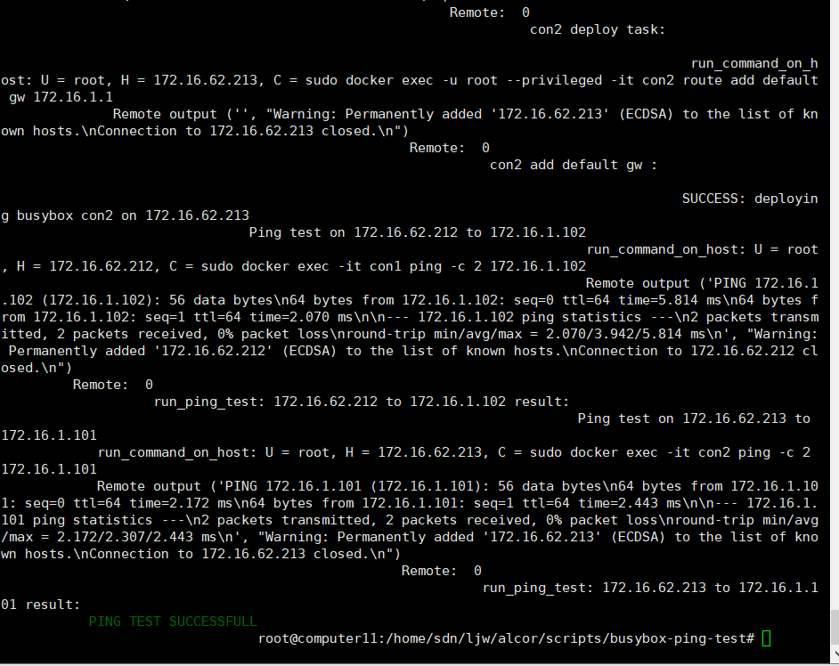
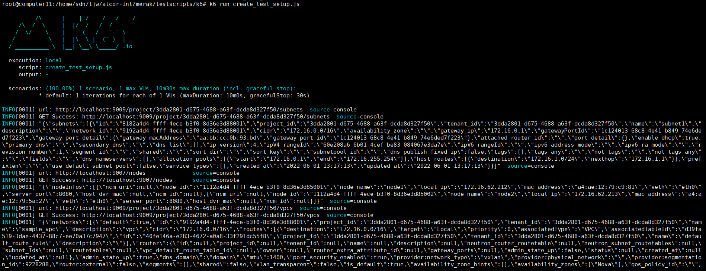
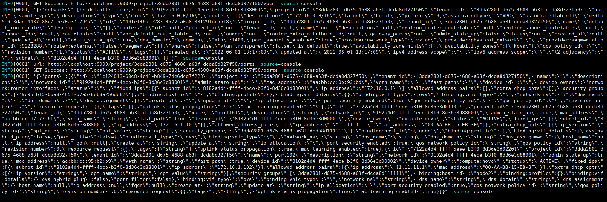
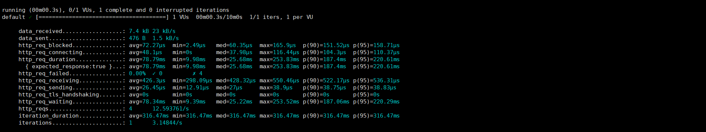

# MIT License
```
Copyright(c) 2020 Futurewei Cloud
Permission is hereby granted, free of charge, to any person obtaining a copy
of this software and associated documentation files(the "Software"), to deal
in the Software without restriction, including without limitation the rights
to use, copy, modify, merge, publish, distribute, sublicense, and/or sell
copies of the Software, and to permit persons to whom the Software is
furnished to do so, subject to the following conditions:
The above copyright notice and this permission notice shall be included in
all copies or substantial portions of the Software.
THE SOFTWARE IS PROVIDED "AS IS", WITHOUT WARRANTY OF ANY KIND, EXPRESS OR
IMPLIED, INCLUDING BUT NOT LIMITED TO THE WARRANTIES OF MERCHANTABILITY,
FITNESS FOR A PARTICULAR PURPOSE AND NONINFRINGEMENT. IN NO EVENT SHALL THE
AUTHORS OR COPYRIGHT HOLDERS BE LIABLE FOR ANY CLAIM, DAMAGES OR OTHER
LIABILITY, WHETHER IN AN ACTION OF CONTRACT, TORT OR OTHERWISE, ARISING FROM,
OUT OF OR IN CONNECTION WITH THE SOFTWARE OR THE USE OR OTHER DEALINGS IN THE SOFTWARE.
```

# K6 Test

# In this README:
- [MIT License](#mit-license)
- [K6 Test](#k6-test)
- [In this README:](#in-this-readme)
  - [Introduction](#introduction)
  - [Directory Structure and Files](#directory-structure-and-files)
  - [Test Environment Setup](#test-environment-setup)
  - [Running Test](#running-test)


## Introduction
This is an end to end test based on the K6 scripts rewritten by busybox-ping-test or TC scripts.


## Directory Structure and Files
alcor-int/merak/testscripts/k6
1. alcor_services.js
3. helper_functions.js
4. prepare_payload.js
5. create_test_setup.js
6. create_test_cases.js
7. alcor_http_api_test.js

## Test Environment Setup
We need 3 clean PCs to deploy Alcor, ACA and K6.

1. Building Alcor
  - We choose a PC to compile and run Alcor, please fork Alcor Github repository by clicking the Fork button on the upper right-hand side of Alcor home page and make a local clone
  ```
      $ git clone https://github.com/<your_github_username>/alcor.git ~/alcor
      $ cd ~/alcor
      $ git submodule update --init --recursive
      $ git remote add upstream https://github.com/futurewei-cloud/alcor.git
      $ git pull upstream master
  ```
  - Run mvn command to clean install the project for development. You could expect to see BUILD SUCCESS at the end of the build console.
  ```
    $ mvn clean install
  ```
  - Deploy an Ignite database for local testing and run unit tests. If this step passes, then you have everything needed to develop, test, and run Alcor.
  ```
    $ ./scripts/test-prep.sh
    $ mvn test
  ```
  - Create all the required iamges for aclor
  ```
      $ ./scripts/build.sh
      $ ./scripts/alcor_services.sh -b
      $ ./scripts/alcor_services.sh -a
  ```
  - Now, execute ```docker ps```, we can see
  

2. Building ACA
  - Other PCs are used to compile and run ACA, please fork Alcor Control Agent Github repository by clicking the Fork button on the upper right-hand side of Alcor Control Agent home page and make a local clone
  ```
      $ git clone --recurse-submodules https://github.com/<your_github_username>/alcor-control-agent.git ~/alcor-control-agent
      $ cd ~/alcor-control-agent
      $ git submodule update --init --recursive
      $ git remote add upstream https://github.com/futurewei-cloud/alcor-control-agent.git 
      $ git pull upstream master
  ```
  - Setup a physical machine or VM to compile the alcor-control-agent
  ```
      $ cd ~/alcor-control-agent/build
      $ sudo ./aca-machine-init.sh
  ```
  - Install OVS in ubuntu (18.04) if needed:
  ```
      $ apt install openvswitch-switch
  ```
  - You can run the test (optional):
  ```
      $ ./build/tests/aca_tests
  ```
  - You should be ready to run the executable:
  ```
      $ ./build/bin/AlcorControlAgent
  ```
PS: There are a large number of downloads in aca-machine-init.sh, which will be downloaded again every time. This may be very unfriendly to users in Chinese Mainland. In this end, we refactor a script named aca-machine-init-local.sh.
```
https://github.com/VanderChen/alcor-control-agent/blob/build-shell/build/aca-machine-init-local.sh
```
In Chinese Mainland, we recommend the following ways to setup a physical machine or VM to compile the alcor-control-agent.
  ```
      $ cd ~/alcor-control-agent/build
      $ mkdir dependencis
      $ sudo ./aca-machine-init-local.sh -D ./dependencis
      $ cp -r dependencis /var/local/git
      $ cd /var/local/git/dependencis
      $ mv * ../
      $ cd ~/alcor-control-agent/build
      $ sudo ./aca-machine-init-local.sh -i
  ```
Note that we split the download and installation steps so that you don't have to download every time


3. Building K6
- We can deploy K6 on the machine where Alcor is deployed.
```
    $ sudo gpg --no-default-keyring --keyring /usr/share/keyrings/k6-archive-keyring.gpg --keyserver hkp://keyserver.ubuntu.com:80 --recv-keys C5AD17C747E3415A3642D57D77C6C491D6AC1D69
    $ echo "deb [signed-by=/usr/share/keyrings/k6-archive-keyring.gpg] https://dl.k6.io/deb stable main" | sudo tee /etc/apt/sources.list.d/k6.list
    $ sudo apt-get update
    $ sudo apt-get install k6
```

## Running Test
1. busybox-ping-test
- We first use busybox-ping-test to verify whether our Alcor and ACA deployments are correct.You can optionally provide the paramter "-b build" to build all the docker images of the alcor services. This step need not be followed for any subsequent tests, unless any changes are made in Alcor.
```
    $ ./busybox_ping_test.py -b build
```
- Next, configure alcor_services.ini and perform a testcase test
```
    $ ./busybox_ping_test.py -t 1
```


PS: The busybox-ping-test script will delete the ACA on the host each time and download, install it again. This part of the code can be commented out.
 
2. k6 test
- K6 test relies on busybox-ping-test. We can divide the ```main()``` in ping_test.py into three stages to execute:

  - Step 1: read the configuration file, restart the Alcor service, and restart the ACA on the host.
  - Step 2: use K6 run to instead prepare_test_xxx or create_test_setup in ping_test.py 
  - Step 3: busybox_container_deploy and run_ping_test

3. Test example
- create_test_setup.js test


