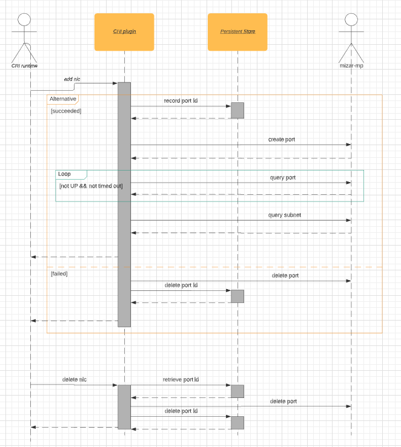

# CNI plugin
This cni plugin works for canonical Kubernetes. It interacts with Mizar-MP controller to provision network resource for pod. It is Mizar-mp controller that manages the lifecycle of network resources under the hood; cni plugin merely request it to conduct the Add/Delete nic.

This doc is mainly for the purpose to capture the agreenments, particularly REST API calls, between Mizar-MP and CNI plugin.

### Scope
Current implementation supports single Project/VPC/subnet Mizar networking environment only, for now. Multiple VPC/subnet support will be considered in the future. 

Current implementation does not support multiple network interfaces. We'll consider support of multiple interfaces/IP addresses in the future.

This cni plugin is unable to cope with nic release on node crashing by itslef. In case of node crash, network resources allocated cannot be released by CNI delete op any more. We will consider the proper recycling by other means, e.g. k8s garbage collection, in other design doc to come. 


## Prerequisites
The default Project/VPC/subnet have been created, as part of setup process. Following values are generated by mizar-MP setup on dev onebox; cni plugin will get these from CNI configuration file.

| desc | uuid |
| --- | --- | 
| default project | 3dda2801-d675-4688-a63f-dcda8d327f50 |
| default VPC | 9192a4d4-ffff-4ece-b3f0-8d36e3d88038 | 
| default subnet | a87e0f87-a2d9-44ef-9194-9a62f178594e |

## Create/Delete nic workflows
It interacts with Mizar-MP controller to create/delete network interface. Mizar-MP has no golang lib yet; so it uses REST calls directly.

Below is the overall interactions between relevant components: 

### Create NIC
1. sends create-port request with the target namespace parameter, gets port-id
* Single port request
method: POST
URL: project/\<project-id\>/ports
body
```json
{
    "port": {
        "project_id": "<default-project-uuid>",
        "id": "<cni-generated-uuid>",
        "name": "k8s_<port-id>",
        "admin_state_up": true,
        "description": "cni <sandbox-id>, ns:<netns>, host:<hostname>",
        "network_id": "<default-subnet-uuid>",
        "veth_name": "eth0",
        "network_ns": "<cni-passed-in-netns>",  //e.g. "/var/run/netns/x"
        "dns_domain": "my-domain.org.",         //optional; not used by cni plugin right now
        "dns_name": "myport",                   //optional; not used by cni plugin right now
        "port_security_enabled": false,
        "allowed_address_pairs": [
            { }
        ],
        "binding:host_id": "<<host_uuid_agreed_by_k8s_and_alcor>>",
        "binding:profile": null,
        "binding:vnic_type": "<<normal/macvtap/direct/baremetal/smart-nic, default is normal>>",
        "fast_path": true
    }
}
```
note: vethNamespace value is the netns Kubernetes has created for the pod and passed it to CNI plugin, which will pass on the Mizar-MP for the agent to place nic into;
binding:host_id is the id of this host registered in mizar-mp, and it must be known by both K8s and Mizar-MP during bootstrap. 
* response
code: 201-Created, if successful
* Bulk create ports
method: POST
URL: project/\<project-id\>/ports
body
```json
{
    "ports": [
        {
            "project_id": "<default-project-uuid>",
            "id": "<cni-generated-uuid>",
            "name": "k8s_<port-id>",
            "admin_state_up": true,
            "description": "cni <sandbox-id>, ns:<netns>, host:<hostname>",
            "network_id": "<default-subnet-uuid>",
            "veth_name": "eth0",
            "veth_namespace": "<cni-created-netns>",
            "dns_domain": "my-domain.org.",
            "dns_name": "myport",
            "port_security_enabled": false,
            "allowed_address_pairs": [
                { }
            ],
            "binding:host_id": "<<host_uuid_agreed_by_k8s_and_alcor>>",
            "binding:profile": { },
            "binding:vnic_type": "<<normal/macvtap/direct/baremetal/smart-nic, default is normal>>"
        },
        {
            "project_id": "<default-project-uuid>",
            "id": "<cni-generated-uuid>",
            "name": "k8s_<port-id>",
            "admin_state_up": true,
            "description": "cni <sandbox-id>, ns:<netns>, host:<hostname>",
            "network_id": "<default-subnet-uuid>",
            "veth_name": "eth0",
            "veth_namespace": "<cni-created-netns>",
            "dns_domain": "my-domain.org.",
            "dns_name": "myport",
            "port_security_enabled": false,
            "allowed_address_pairs": [
                { }
            ],
            "binding:host_id": "<<host_uuid_agreed_by_k8s_and_alcor>>",
            "binding:profile": null,
            "binding:vnic_type": "<<normal/macvtap/direct/baremetal/smart-nic, default is normal>>",
            "fast_path": true
        }
    ]
}
```
code: 201-Created, if successful

2. polling get-port till the port is in up state.
* request
method: GET
URL: project/\<project-id\>/ports/\<port-id\>
* response
body
```json
{
    "port": 
    {
      "project_id": "<project-uuid>",
      "id": "<port-id>",
      ...
      "status": "<UP/DOWN/PENDING>",
      ...
      "mac_address": "<mac-address>",
      "fixed_ips": [
        {  
          "subnet_id": "<default-subnet-uuid>",
          "ip_address": "<ip-address>"
        }
      ],
      ... 
    }
}
```
notes:
nic info like MAC & IP address is returned in the response body;
only when status is "UP" can the port considered as ready; it may timeout after some predefined period (1 minute in this implementation).  

3. query subnet detail to get netmask & gateway IP
* request
<br/>method: GET
<br/>URL: project/\<project-id\>/subnets/\<subnet-id\>
* response
<br/> sample body (omitting uninteresting info for brievity)
```json
{
    "subnet": {
      "project_id": "xxxx-xxx-xxxx",
      "id": "xxxx-xxx-xxxx",
      ...
      "cidr": "192.168.100.0/24",
      "gateway_ip": "192.168.100.1"    
    }
}
```

### Delete NIC
method: DELETE
URL: project/\<project-id\>/ports/\<port-id\>
Response Code: 200 if successfully deleted

## Deployment on Dev Onebox node
* mizar-mp authentication info
for now, plugin does not requires any authentication data to access Mizar-MP.

* /etc/cni/net.d/mizarmp.conf
// todo: specify host
```json
{
  "cniVersion": "0.3.1",
  "name": "mizarmp-default",
  "type": "mizarmp",
  "mpurl": "http://127.0.0.1", //for onebox
  "subnet": "a87e0f87-a2d9-44ef-9194-9a62f178594e",
  "project": "3dda2801-d675-4688-a63f-dcda8d327f50",
  "hostId": "localhost"
}
```

* /opt/cni/bin/mizarmp
